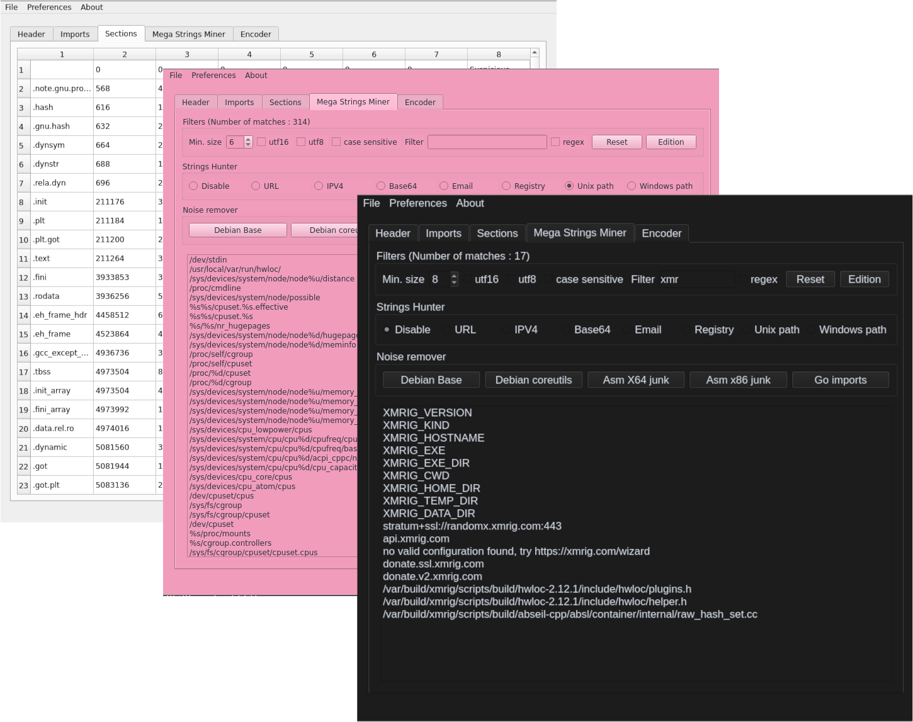

# MasterStringz

MasterStringz is a Qt-based tool for analyzing and filtering strings extracted from binaries.




## Features

- Analyze strings from binary files.
- Filter by category: URL, email, file path, registry keys, IP addresses, and more.
- Filter by string length, custom regex, or category.
- Remove common strings found in legitimate binaries (Ubuntu, Debian, Golang, etc).
- Exclude "junk" strings matching typical instruction patterns.
- Simplifies and accelerates the analysis of binary strings for reverse engineering or malware research.

## Requirements

- Qt 6.x (tested with 6.7.0)
- qmake
- make
- C++ compiler (GCC, Clang, MSVC)

## Build Instructions

```sh
qmake CuttieElf.pro
make -j $(nproc)
```

The binary will be generated in the project directory.

## Usage

Run the generated executable and open a binary file to begin string analysis and filtering.

## Contribution

Contributions are welcome. Open issues or pull requests for bug reports or features.

## License

This project is licensed under the MIT License.